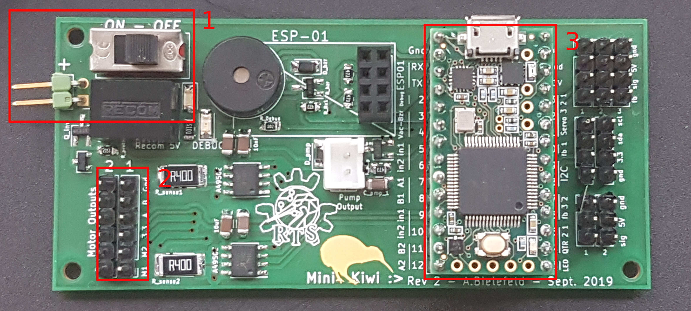

# Formation régulation PID

## Information à rajouter

- [ ] Explication générale du PID
- [ ] Explication générale des encodeurs
- [ ] petite présentation du miniKiwi
- [ ] régulations en vitesse et Position
- [ ] problèmes de rampes de vitesse
- [ ] considérations hardware, moteur DC


## Déroulement de la Formation


## Prérequis

- Codage C/C++ de base
- Formation Arduino RTS

## La carte miniKiwi

Pendant toute cette formation, vous ne travaillerez plus avec la carte Arduino Nano (celle utilisée lors de formations de base Arduino) mais avec le _miniKiwi_ et la _Teensy_.
Le _miniKiwi_ est un _shield_ (une carte fille) pour la carte [Teensy 3.2](https://www.pjrc.com/teensy/teensy31.html).

La carte Teensy est une carte du même type que l'Arduino nano utilisé lors des tutoriels de base. On la code en C/C++ et on y upload ce code qui va effectuer des actions avec les différentes _entrées/sorties_ exactement comme pour l'Arduino nano.

Le shield _miniKiwi_ ajoute de nombreuses fonctionnalités à la Teensy, en branchant sur ses entrées/sorties différents composants.

<br>

Aujourd'hui on va travailler avec ces parties de la carte:

1. Connecteur batterie (attention au sens, le + est indiqué)
2. Connecteurs moteurs
3. Teensy 3.2

### Utilisation de la Carte

- Brancher la batterie (attention au sens, le **+** est marqué sur la carte) et allumer la carte en mettant le bouton sur "ON".
- Pour uploader du code, la carte doit être allumée.
- **Attention au branchement des moteurs!** les indications sur la carte sont fausses, il faut brancher le moteur fil noir sur la pin **M1**.
- Une fois la carte allumée, la LED verte s'allume.

### Spécificités de code

Le code utilisé est exactement le même que pour les formations Arduino, le seul changement est que les entrées/sorties sont déjà utilisés par différents composants.

#### Les différentes pins

Sur la carte, on peut lire le nom des pins, et leur fonctionnalités juste à côté de la Teensy.


<br>


Les pins d'entrées sorties qui nous intéressent aujourd'hui sont :

- Les pins `INx` qui sont branchés sur les entrées des _drivers de moteurs_ (circuits intégrés qui délivrent la puissance aux moteurs).
- Les pins `A` et `B`, qui sont les entrées de encodeurs présents sur les moteurs.<br>

## Prise en main des Entrée/Sorties numériques de la carte

Les signaux numériques sont des 0 et 1 représentés par GND (0V) et VCC (3.3V) pour la carte Teensy.
Cela contraste avec la logique 0-5V de la carte Arduino Nano utilisée pendant la formation de base.

Le fichier `board.h` donne les noms et fonctionnalités de chaques pins, ainsi il n'est pas nécessaire d'utiliser des numéros comme avec l'Arduino Nano.

Par exemple `LED_DEBUG` permet d'accéder à la pin de la LED rouge et `LED_TEENSY` permet d'accéder à la pin de la LED orange sur la Teensy.

```c++

#include "board.h" // Contient les noms de pins de la Teensy

void setup() {
	//Déclaration en output des deux leds du miniKiwi
	pinMode(LED_DEBUG, OUTPUT);
	pinMode(LED_TEENSY, OUTPUT);
}

void loop() {
	//Ce programme fait clignoter les deux LED de façon alternée
	digitalWrite(LED_DEBUG, HIGH);
	delay(300);
	digitalWrite(LED_TEENSY, HIGH);
	digitalWrite(LED_DEBUG, LOW);
	delay(300);
	digitalWrite(LED_TEENSY, LOW);

}
```

# Prise en main des moteurs courant continu

## Le moteur courant continu

Le miniKiwi dispose de deux sorties pour contrôler deux moteurs à courant continu.

Le moteur à courant continu est contrôlé en tension. Il suffit d'y appliquer un différence de potentiel pour le faire tourner, la tension étant proportionnelle à la vitesse de rotation du moteur.

Les moteurs utilisés avec le miniKiwi sont des [Micromoteurs Pololu](https://www.pololu.com/product/3041), ce sont des moteurs 12V, 330 tours/minute.

Ainsi, quand on les alimente avec une tension fixe, 12V, ils tournent à 330 tours par minute. Quand la tension baisse, la vitesse baisse aussi.

## Le driver de moteurs

Pour contrôler un moteur, il faut beaucoup plus de tension et de courant que ne peuvent fournir les pins de la Teensy.

On utilise alors un _driver_, c'est un circuit dit "de puissance", il est capable de travailler avec une tension de 12V, et des courants jusqu'à 1A (comparé au 3.3V, et aux 20mA des entrées/sorties de la teensy).

Le circuit de puissance peut faire varier la tension issue de la batterie entre 0 et 12V.

Pour contrôler les drivers du miniKiwi, il faut utiliser les pins :

- `IN1_1` et `IN2_1` pour la sortie moteur 1
- `IN1_2` et `IN2_2` pour la sortie moteur 2.

Il faut juste les déclarer en `OUTPUT`, et les contrôler avec les fonctions `digitalWrite` et/ou `analogWrite` comme toute autre sortie sur Arduino.

La logique de contrôle du moteur est décrite dans le tableau ci dessous:

IN1 | IN2 | Fonction réalisée
---- | ---- | ------
`LOW`| `HIGH` | Marche avant
`HIGH`| `LOW` | Marche arrière
`LOW` | `LOW` | Arrêt

```c++

#include "board.h" // Contient les noms de pins de la Teensy

void setup() {
	//Déclaration en output des deux entrées du driver de moteur 1
	pinMode(IN1_1, OUTPUT);
	pinMode(IN2_1, OUTPUT);
}

void loop() {
	//Ce programme fait tourner le moteur dans un sens, l'arrête, puis le fait tourner dans le sens inverse

	digitalWrite(IN1_1, LOW); //Ligne 1 du tableau
	digitalWrite(IN2_1, HIGH);
	delay(1000);

	digitalWrite(IN1_1, LOW); //Ligne 3
	digitalWrite(IN2_1, LOW);
	delay(1000);

	digitalWrite(IN1_1, HIGH); //Ligne 2
	digitalWrite(IN2_1, LOW);
	delay(1000);

	digitalWrite(IN1_1, LOW); //Ligne 3
	digitalWrite(IN2_1, LOW);
	delay(1000);

}
```

### Challenges

- Faire un programme qui fait faire coucou au moteur
- Faire déplacer le moteur de 1 tour exactement
- Faire déplacer le moteur de 2 tours exactement

## Faire varier la vitesse du moteur

Pour faire varier la vitesse du moteur, il suffit d'utiliser la logique précédente avec la fonction `analogWrite` au lieu de la fonction `digitalWrite`.

La fonction `analogWrite` va faire varier la tension de 0 à 12V, pour des valeurs de 0 à 255.

```c++

#include "board.h" // Contient les noms de pins de la Teensy

void setup() {
	//Déclaration en output des deux entrées du driver de moteur 1
	pinMode(IN1_1, OUTPUT);
	pinMode(IN2_1, OUTPUT);
}

void loop() {
	//fait avancer le moteur à une vitesse progressivement plus élevé puis l'arrête, et pause pendant 1 seconde.

	digitalWrite(IN1_1, LOW);

	for (int k = 0; k<= 255; k++){
		analogWrite(IN2_1, k);
		delay(50);
	}

	digitalWrite(IN1_1, LOW); //Ligne 3
	digitalWrite(IN2_1, LOW);
	delay(1000);

}
```

### Challenges

- Faire accélérer le moteur plus vite
- Faire un vitesse max plus faible
- Faire accélerer puis décélerer le moteur

## Prise en main des encodeurs

Les moteurs pololu utilisés possèdent aussi des encodeurs qui permettent de récupérer la position des moteurs, pour les asservir.
