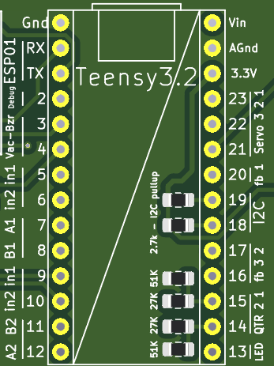

# Formation régulation PID

## Information à rajouter

- [ ] Explication générale du PID
- [ ] Explication générale des encodeurs
- [ ] petite présentation du miniKiwi
- [ ] régulations en vitesse et Position
- [ ] problèmes de rampes de vitesse
- [ ] considérations hardware, moteur DC

## Déroulement de la Formation

## Prérequis

- Codage C/C++ de base
- Formation Arduino RTS

## La carte miniKiwi

Pendant toute cette formation, vous ne travaillerez plus avec la carte Arduino Nano (celle utilisée lors de formations de base Arduino) mais avec le _miniKiwi_.

Le _miniKiwi_ est un _shield_ (une carte fille) pour la carte [Teensy 3.2](https://www.pjrc.com/teensy/teensy31.html).

La carte Teensy est une carte du même type que l'Arduino nano utilisé lors des tutoriels de base. On la code en C/C++ et on y upload ce code qui va effectuer des actions avec les différentes _entrées/sorties_ exactement comme pour l'Arduino nano.

Le shield _miniKiwi_ ajoute de nombreuses fonctionnalités à la Teensy, en branchant sur ses entrées/sorties différents composants.

### Aperçu des fonctionnalités

1. Branchement batterie (Batterie 12V)
2. Sortie moteurs courant continu et encodeurs
3. Connection carte Wifi (ESP01) et Buzzer
4. Sortie pompe pour ventouse
5. Carte Teensy 3.2 (connecteur USB orienté vers le haut)
6. Sorties Servomoteurs (x3)
7. Sorties Lidar
8. Entrée capteur suivi de ligne

### Utilisation de la Carte

- Brancher la batterie (attention au sens, le **+** est marqué sur la carte) et allumer la carte en mettant le bouton sur "ON".
- Pour uploader du code, la carte doit être allumée.
- **Attention au branchement des moteurs!** les indications sur la carte sont fausses, il faut brancher le moteur fil noir sur la pin **M1**.
- Une fois la carte allumée, la LED verte s'allume.

### Spécificités de code

Le code utilisé est exactement le même que pour les formations Arduino, le seul changement est que les entrées/sorties sont déjà utilisés par différents composants.

#### Les différentes pins

Sur la carte, on peut lire le nom des pins, et leur fonctionnalités juste à côté de la Teensy.

Les pins d'entrées sorties qui nous intéressent aujourd'hui sont :

- Les pins INx qui sont branchés sur les entrées des _drivers de moteurs_ (circuits intégrés qui délivrent la puissance aux moteurs).
- Les pins A et B, qui sont les entrées de encodeurs présents sur les moteurs.
