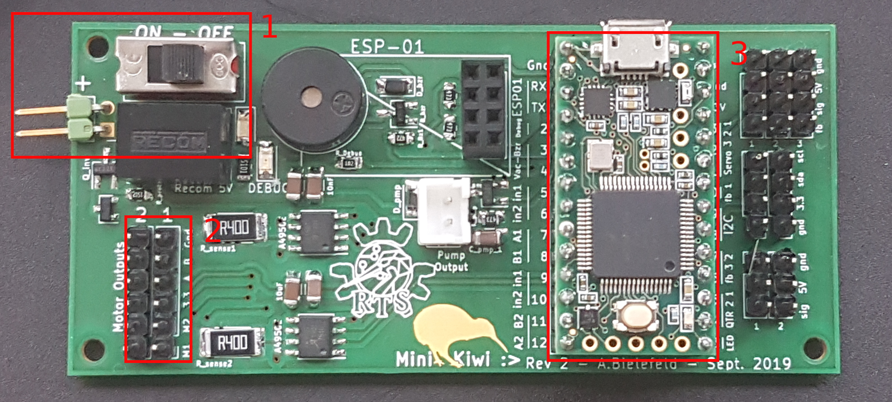
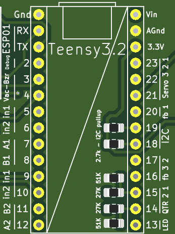
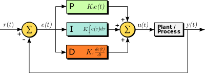

# Formation régulation PID

## Information à rajouter

- [ ] PidInterface
	- [ ] Generalise BeautifulPlot
		- [ ] Multiple subplots
		- [ ] Multiple lines
		- [ ] Give array of subplots, lines, labels
	- [ ] Remove QLineEdit and add plot of output and integral instead
	- [ ] Add button to reset integral
	- [ ] Immediate effect of mode and anti_windup checkbox
		- [ ] disable pid
	- [x] ~join read thread when closing UI~ Made the read thread a daemon
- [ ] Remplacer ne pas toucher le moteur par ne pas bloquer
- [ ] Explication serial monitor
- [ ] réduction + pas par tour réduit ou non réduit
- [ ] régulations en vitesse et Position
- [ ] problèmes de rampes de vitesse
- [x] petite présentation du miniKiwi
- [x] Explication générale des encodeurs
- [x] considérations hardware, moteur DC


## Prérequis

- Codage C/C++ de base
- Formation Arduino RTS

## Déroulement
- Prévoir 45 minute pour régler les pid en vitesse et en position

## La carte miniKiwi

Pendant toute cette formation, vous ne travaillerez plus avec la carte Arduino Nano (celle utilisée lors de formations de base Arduino) mais avec le _miniKiwi_ et la _Teensy_.
Le _miniKiwi_ est un _shield_ (une carte fille) pour la carte [Teensy 3.2](https://www.pjrc.com/teensy/teensy31.html).

La carte Teensy est une carte du même type que l'Arduino nano utilisé lors des tutoriels de base. On la code en C/C++ et on y upload ce code qui va effectuer des actions avec les différentes _entrées/sorties_ exactement comme pour l'Arduino nano.

Le shield _miniKiwi_ ajoute de nombreuses fonctionnalités à la Teensy, en branchant sur ses entrées/sorties différents composants.

<br>

Aujourd'hui on va travailler avec ces parties de la carte:

1. Connecteur batterie (attention au sens, le + est indiqué)
2. Connecteurs moteurs
3. Teensy 3.2

### Utilisation de la Carte

- Brancher la batterie (attention au sens, le **+** est marqué sur la carte) et allumer la carte en mettant le bouton sur "ON".
- Pour uploader du code, la carte doit être allumée.
- **Attention au branchement des moteurs!** les indications sur la carte sont fausses, il faut brancher le moteur fil noir sur la pin **M1**.
- Une fois la carte allumée, la LED verte s'allume.
- **Attention! Ne pas bloquer le moteur lorsqu'il bouge**, cela peut détruire les engrenages, ou le faire surchauffer!

### Spécificités de code

Le code utilisé est exactement le même que pour les formations Arduino, le seul changement est que les entrées/sorties sont déjà utilisés par différents composants.

#### Les différentes pins

Sur la carte, on peut lire le nom des pins, et leur fonctionnalités juste à côté de la Teensy.


<br>


Les pins d'entrées sorties qui nous intéressent aujourd'hui sont :

- Les pins `INx` qui sont branchés sur les entrées des _drivers de moteurs_ (circuits intégrés qui délivrent la puissance aux moteurs).
- Les pins `A` et `B`, qui sont les entrées de encodeurs présents sur les moteurs.<br>

## Prise en main des Entrée/Sorties numériques de la carte

Les signaux numériques sont des 0 et 1 représentés par GND (0V) et VCC (3.3V) pour la carte Teensy.
Cela contraste avec la logique 0-5V de la carte Arduino Nano utilisée pendant la formation de base.

Le fichier `board.h` donne les noms et fonctionnalités de chaques pins, ainsi il n'est pas nécessaire d'utiliser des numéros comme avec l'Arduino Nano.

Par exemple `LED_DEBUG` permet d'accéder à la pin de la LED rouge et `LED_TEENSY` permet d'accéder à la pin de la LED orange sur la Teensy.

Pour utiliser ces noms il faut inclure le fichier `board.h`.
Ce fichier est situé dans le dossier `/include`, on y trouve toutes les fonctionnalités de la carte, et les pins pour y accéder.

```c++

#include "board.h"

void setup() {
	//Déclaration en output des deux leds du miniKiwi
	pinMode(LED_DEBUG, OUTPUT);
	pinMode(LED_TEENSY, OUTPUT);
}

void loop() {
	//Ce programme fait clignoter les deux LED de façon alternée
	digitalWrite(LED_DEBUG, HIGH);
	delay(300);
	digitalWrite(LED_TEENSY, HIGH);
	digitalWrite(LED_DEBUG, LOW);
	delay(300);
	digitalWrite(LED_TEENSY, LOW);

}
```

# Prise en main des moteurs courant continu

## Le moteur courant continu

Le miniKiwi dispose de deux sorties pour contrôler deux moteurs à courant continu.

Le moteur à courant continu est contrôlé en tension. Il suffit d'y appliquer un différence de potentiel pour le faire tourner, la tension étant proportionnelle à la vitesse de rotation du moteur.

Les moteurs utilisés avec le miniKiwi sont des [Micromoteurs Pololu](https://www.pololu.com/product/3041), ce sont des moteurs 12V, 330 tours/minute.

Ainsi, quand on les alimente avec une tension fixe, 12V, ils tournent à 330 tours par minute. Quand la tension baisse, la vitesse baisse aussi.

## Le driver de moteurs

Pour contrôler un moteur, il faut beaucoup plus de tension et de courant que ne peuvent fournir les pins de la Teensy.

On utilise alors un _driver_, c'est un circuit dit "de puissance", il est capable de travailler avec une tension de 12V, et des courants jusqu'à 1A (comparé au 3.3V, et aux 20mA des entrées/sorties de la teensy).

Pour contrôler les drivers du miniKiwi, il faut utiliser les pins :

- `IN1_1` et `IN2_1` pour la sortie moteur 1
- `IN1_2` et `IN2_2` pour la sortie moteur 2

Il faut juste les déclarer en `OUTPUT`, et les contrôler avec les fonctions `digitalWrite` et/ou `analogWrite` comme toute autre sortie sur Arduino.

La logique de contrôle du moteur est décrite dans le tableau ci dessous:

`IN1` et `IN2` sont les entrées logiques du drivers, `OUT1` et `OUT2` sont les sorties qui sont branchées de chaque côté du moteur.

IN1 | IN2 | OUT1 | OUT2 | Fonction réalisée
---- | ---- | ---- | ---- | ---- |
`0`| `1`|`0V`|`12V`| Marche avant
`1`| `0`|`12V`|`0V`| Marche arrière
`0` | `0`|`Z`|`Z`| Arrêt

_Note_ : L'état `Z` correspond à une sortie débranchée du moteur (comme un interrupteur ouvert).

Le driver sert d'interface entre la teensy et le moteur en fournissant un circuit logique (les entrées `IN1` et `IN2`) qui contrôle un [Pont en H](https://fr.wikipedia.org/wiki/Pont_en_H) branché sur les sorties `OUT1` et `OUT2`.


```c++

#include "board.h"

void setup() {
	//Déclaration en output des deux entrées du driver de moteur 1
	pinMode(IN1_1, OUTPUT);
	pinMode(IN2_1, OUTPUT);
}

void loop() {
	//Ce programme fait tourner le moteur dans un sens, l'arrête, puis le fait tourner dans le sens inverse

	digitalWrite(IN1_1, LOW); //Ligne 1 du tableau
	digitalWrite(IN2_1, HIGH);
	delay(1000);

	digitalWrite(IN1_1, LOW); //Ligne 3
	digitalWrite(IN2_1, LOW);
	delay(1000);

	digitalWrite(IN1_1, HIGH); //Ligne 2
	digitalWrite(IN2_1, LOW);
	delay(1000);

	digitalWrite(IN1_1, LOW); //Ligne 3
	digitalWrite(IN2_1, LOW);
	delay(1000);

}
```

### Challenges

- Faire déplacer le moteur de 1 tour exactement
- Faire déplacer le moteur de 2 tours exactement
- Remarquer qu'il est facile de ralentir le moteur avec sa main (le mettre à une vitesse basse pour cela)


## Faire varier la vitesse du moteur

Pour faire varier la vitesse du moteur, il suffit d'utiliser la logique précédente avec la fonction `analogWrite` au lieu de la fonction `digitalWrite`.

La fonction `analogWrite` va faire varier la tension de 0 à 12V, pour des valeurs de 0 à 255.

```c++

#include "board.h"

void setup() {
	//Déclaration en output des deux entrées du driver de moteur 1
	pinMode(IN1_1, OUTPUT);
	pinMode(IN2_1, OUTPUT);
}

void loop() {
	//fait avancer le moteur à une vitesse progressivement plus élevée puis l'arrête, et pause pendant 1 seconde.

	digitalWrite(IN1_1, LOW);

	for (int k = 0; k<= 255; k++){
		analogWrite(IN2_1, k);
		delay(50);
	}

	digitalWrite(IN1_1, LOW); //Ligne 3
	digitalWrite(IN2_1, LOW);
	delay(1000);

}
```

### Challenges

- Faire accélérer le moteur plus vite
- Faire un vitesse max plus faible
- Faire accélerer puis décélerer le moteur

## Prise en main des encodeurs

Les moteurs pololu utilisés possèdent aussi des encodeurs qui permettent de récupérer la position des moteurs, pour les asservir.

Les encodeurs utilisés la plupart du temps sont dit _"encodeurs à quadrature de phase"_.

_Il n'est pas important pour la formation de comprendre leur principe de fonctionnement_, vous pouvez cliquer [ici](https://www.pjrc.com/teensy/td_libs_Encoder.html) pour des explications sur la librairie que nous allons utiliser.

```c++

#include <Encoder.h>
#include "board.h"

Encoder encoder(A_1, B_1);
int32_t position = 0;

void setup() {
	// On initialise la liaison série et on attend qu'elle s'établisse
	Serial.begin(9600);
	delay(2000);

	while(!Serial.available()); // Appuyer sur une touche pour continuer
}

void loop() {
	position = encoder.read(); //On lit la valeur de la position et on la stocke dans position
	Serial.println(position);
	delay(100);
}

```
Vous pouvez faire tourner le moteur à la main pour voir la position varier.
- Noter quel est le sens de rotation qui fait augmenter la valeur de position.

### Challenges

- On sait que le moteur a une réduction 100:1, déterminer le nombre de pas par tours de l'encodeur et la précision en degrée.
- Convertir et afficher la valeur `position` en tours ou en degrées.

## Utiliser encodeurs et moteurs en même temps

Le code suivant fait tourner le moteur tout en retournant sa valeur de position en pas dans le moniteur série.

```c++

#include <Encoder.h>
#include "board.h"
#include "motor.h"

Encoder encoder(A_1, B_1); //Déclaration des pins de l'encodeur
int32_t position = 0;

Motor motor(IN1_1, IN2_1);

void setup() {
	// On initialise la liaison série et on attend qu'elle s'établisse
	Serial.begin(9600);
	delay(2000);

	while(!Serial.available()); // Appuyer sur une touche pour continuer
	motor.setPwm(127);
}

void loop() {
	position = encoder.read();
	Serial.println(position);
	delay(100);
}
```

Ce code utilise une librairie qu'on vous a codé pour vous simplifier la vie, voici ses fonctions :

- `Motor(const uint8_t pin1, const uint8_t pin2);` Cette fonction initialise les pins du moteur.
- `void setPwm(const int16_t pwm);` Cette fonction envoie une consigne de PWM (tension) au moteur, la valeur `pwm` varie de _-255 à 255_.
- `int16_t getPwm() const;` Permet de récupérer la valeur de _pwm_ qui a été envoyée au moteur.

## challenges

- Afficher la vitesse du moteur en tours par seconde.

## Régulation PID

A ce stade, vous avez du remarquer que même si la vitesse du moteur est proportionnelle à la valeur de tension a ses bornes, il est impossible de le contrôler précisément.

Vous disposez de :

- La librairie encodeur et la capacité à calculer l'angle du moteurs.
- La librairie de contrôle de vitesse/direction moteur introduite précédemment.

- [ ] Explication de P, I, D
- [ ] Saturation de la commande
- [ ] Réglage du PID
- [ ] Anti-Windup
- [ ] PID Cascade
- [ ] Période d'échantillonnage effet



Le terme _P_ est proportionnel à l'erreur.

Points forts:
- Temps de montée diminué
- Erreur statique diminué

Points faibles:
- Dépassement augmente
- Stabilité dégradée

Le terme _I_ intègre l'erreur.

Points forts:
- Erreur statique éliminée
- Temps de montée diminué
- Temps de réponse diminué

Points faibles:
- Dépassement augmenté
- Stabilité dégradée

Le terme _D_ dérive le signal et permet d'amortir

Points forts:
- Stabilité améliorée

Points faibles:
-

Plus un terme est augmenté plus l'effet est important


Effet d'augementation indépendante des paramètres

| Effet            | Kp | Ki | Kd |
| ---------------- | -- | -- | -- |
| Temps de montée  | Diminue | Diminue | Négligeable |
| Dépassement      | Augmente | Augmente | Diminue |
| Temps de réponse | Négligeable | Augmente | Diminue |
| Erreur statique  | Diminue | Élimine | Pas d'effet |
| Stabilité        | Dégrade | Dégrade | Améliore si Kd est petit |


### Anti-windup
Le terme _I_ intègre l'erreur.
Sur la zone de montée l'erreur est grande et sur la zone de stabilisation

Avec une erreur plus petite, le terme _I_ peut être augmenté

- Permet d'activer le terme _I_ uniquement dans la zone linéaire, on n'en a pas besoin pendant le temps de montée c'est le terme _P_ qui s'en occupe.

```c++
#include <Arduino.h>
#include <Encoder.h>
#include "board.h"
#include "motor.h"
#include "pid.h"
#include "binserial.h"

// Réglages du PID
typedef struct {
	uint32_t sample_time;
	float kp;
	float ki;
	float kd;
	float setpoint;
	bool mode;
	bool anti_windup;
} settings_t;

// Variables du PID
typedef struct {
	float input;
	float setpoint;
	float output;
	float integral;
} variables_t;

settings_t settings = {10, 0, 0, 0, 0, false, true}; // Réglages du PID
size_t settings_size = 22;

variables_t variables = {0, 0, 0, 0};
size_t variables_size = 16;

uint32_t time; // Temps de la dernière période d'échantillonnage

Motor motor(IN1_1, IN2_1); // Initialise motor
Encoder encoder(A_1, B_1); // Initialise encoder

PID pid(0, 0, 0); // Initialise pid

void setup() {
	Serial.begin(9600); // Initialise Serial communication
	while (!Serial); // Attend que la liaison soit établie

	// Initialise LED de debug
	pinMode(LED_BUILTIN, OUTPUT);
	digitalWrite(LED_BUILTIN, HIGH);

	time = millis() - settings.sample_time; // Initialise le temps
}

void loop() {
	// Éxécute les instruction toutes les périodes d'échantillonnages
	if (millis() - time > settings.sample_time) {
		time = millis();

		// Calcul et applique le PID
		variables.input = encoder.read(); // Lit l'entrée

		pid.setInput(variables.input); // Met à jour l'entrée du PID
		pid.compute(); // Calcul le PID

		variables.integral = pid.getIntegral(); // Lit le terme intégral
		variables.output = pid.getOutput(); // Lit la sortie
		motor.setPwm(variables.output); // Applique la sortie

		// Envoie les variables du PID à pid_interface.py
		writeData(&variables, variables_size);

		// Met à jour les réglages du PID si réception de nouveaux réglages
		if (Serial.available()) {
			digitalWrite(LED_BUILTIN, !digitalRead(LED_BUILTIN)); // Change l'état de la led
			readData(&settings, settings_size); // Reçoit les réglages

			// Applique les réglages
			pid.setMode(settings.mode);
			pid.setAntiWindup(settings.anti_windup);
			pid.setTunings(settings.kp, settings.ki, settings.kd);
			pid.setSetpoint(settings.setpoint);
			variables.setpoint = settings.setpoint;
		}
	}
}
```

### Cascade PID

```c++
#include <Arduino.h>
#include <Encoder.h>
#include "board.h"
#include "motor.h"
#include "pid.h"
#include "binserial.h"

float last_position;
// Réglages du PID
typedef struct {
	uint32_t sample_time;
	float kp;
	float ki;
	float kd;
	float setpoint;
	bool mode;
	bool anti_windup;
} settings_t;

// Variables du PID
typedef struct {
	float input;
	float setpoint;
	float output;
	float integral;
} variables_t;

settings_t settings = {10, 0, 0, 0, 0, false, true}; // Réglages du PID
size_t settings_size = 22;

variables_t position_variables = {0, 0, 0, 0}, speed_variables = {0, 0, 0, 0};
size_t variables_size = 16;

uint32_t time; // Temps de la dernière période d'échantillonnage

Motor motor(IN1_1, IN2_1); // Initialise motor
Encoder encoder(A_1, B_1); // Initialise encoder

PID speed_pid(60, 35, 0); // Initialise pid
PID position_pid(0, 0, 0); // Initialise pid

void setup() {
	Serial.begin(9600); // Initialise Serial communication
	while (!Serial); // Attend que la liaison soit établie

	// Initialise LED de debug
	pinMode(LED_BUILTIN, OUTPUT);
	digitalWrite(LED_BUILTIN, HIGH);

	// while(!Serial.available()); // Attend une consigne de pid_interface.py

	time = millis() - settings.sample_time; // Initialise le temps
}

void loop() {
	// Éxécute les instruction toutes les périodes d'échantillonnages
	if (millis() - time > settings.sample_time) {
	time = millis();
	last_position = position_variables.input;
	position_variables.input = encoder.read();
		// Calcul et applique le PID
	speed_variables.input = (position_variables.input-last_position)/1.2/settings.sample_time;

	  // Lit l'entrée
	position_pid.setInput(position_variables.input);
	position_pid.compute(); // Calcul le PID
	speed_variables.setpoint = position_variables.output = position_pid.getOutput();
	position_variables.integral = position_pid.getIntegral();

	speed_pid.setSetpoint(speed_variables.setpoint);
		speed_pid.setInput(speed_variables.input); // Met à jour l'entrée du PID
		speed_pid.compute(); // Calcul le PID

		speed_variables.integral = speed_pid.getIntegral(); // Lit le terme intégral
		speed_variables.output = speed_pid.getOutput(); // Lit la sortie

		motor.setPwm(speed_variables.output); // Applique la sortie

		// Envoie les variables du PID à pid_interface.py
		writeData(&position_variables, variables_size);

		// Met à jour les réglages du PID si reData(&variables, variables_size);éception de nouveaux réglages
		if (Serial.available()) {
			digitalWrite(LED_BUILTIN, !digitalRead(LED_BUILTIN)); // Change l'état de la led
			readData(&settings, settings_size); // Reçoit les réglages

			// Applique les réglages
			speed_pid.setMode(settings.mode);
			position_pid.setMode(settings.mode);
			position_pid.setAntiWindup(settings.anti_windup);
			position_pid.setTunings(settings.kp, settings.ki, settings.kd);
			position_pid.setSetpoint(settings.setpoint);
			position_variables.setpoint = settings.setpoint;
		}
	}
}
```

## Ressources
- [PID controller - Wikipédia](https://en.wikipedia.org/wiki/PID_controller)
- []()
